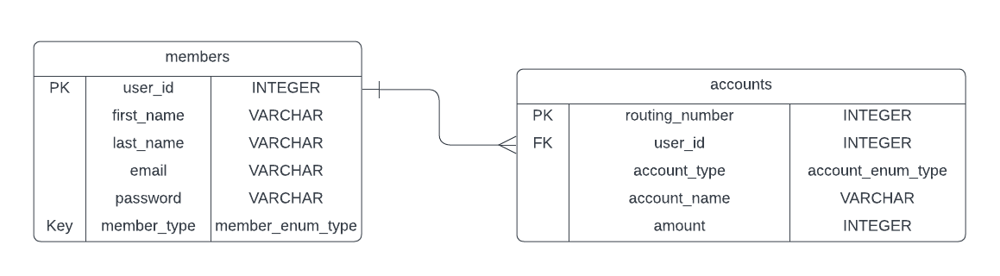

# Banking Application

### Details
This application is meant to assist members of a bank control their funds by depositing and withdrawing from their account(s).
It utilizes a database that will be stored locally using PostgreSQL.

### ERD (ENTITY RELATIONAL DATA)

## User Stories

As a user, I can:

-   [x] register a new user account with the system (must be secured with a password)
-   [x] login with my existing credentials
-   [x] create at least one account
-   [x] deposit funds into an account (use doubles, not ints)
-   [x] withdraw funds from an account (no overdrafting!)
-   [x] view the balance of my account(s) (all balance displays must be in proper currency format)

### Suggested Bonus User Stories

As a user I can:

-   [ ] view the transaction history for an account
-   [x] create multiple accounts per user (checking, savings, etc.)
-   [ ] share a joint account with another user
-   [ ] transfer money between accounts

### Custom User Stories